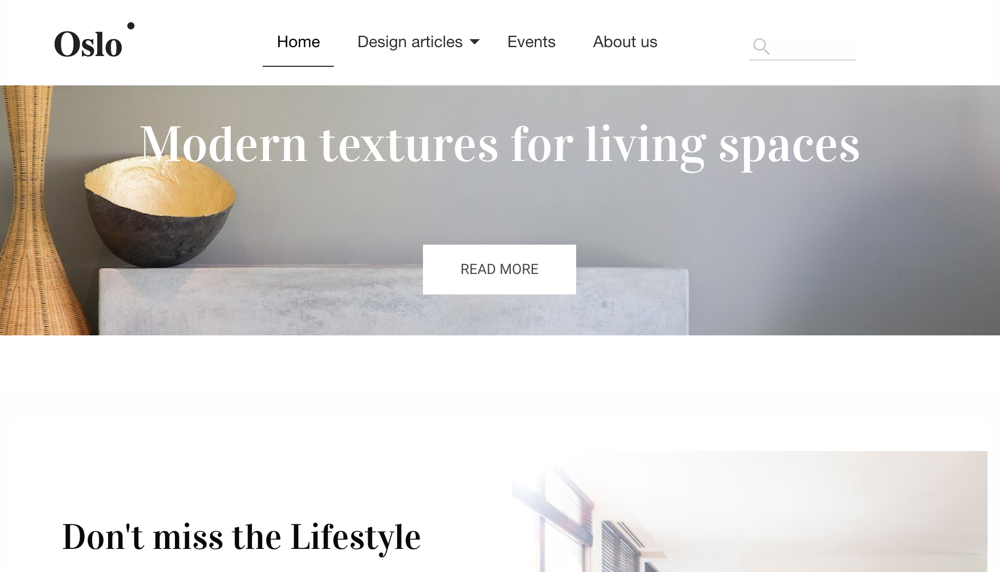

# Sample React Site

This sample is intended for use with the Sites feature. For using Acoustic Content headlessly (not using the Sites feature), this sample may be more useful - https://github.com/acoustic-content-samples/sample-react-traveler-website.

As part of the Sites feature in Acoustic Content (formerly Watson Content Hub or WCH), a single page application was implemented to serve web sites. The Single Page Application is hosted on Acoustic Content and stored as unmanaged assets. It leverages a set of content types, pages, categories, ... to render the Oslo sample application. The default single page application was implemented with Angular. The artifacts stored in WCH for Oslo are independent of the single page application.

This sample contains the Single Page Site Application implemented with React instead of the default angular site application. You can find more information about the default site application implemented with angular here:
[Angular site application](https://github.com/ibm-wch/wch-site-application/).
You can replace the default single page application with the react implementations in this repository. Note that this will overlay the default Angular based application with the vue.js or React implementation.

See the topic on Restoring the default Angular based application in case you want to switch back.

Updates:
At the beginning of July 2020 we have added the capabilty to use inline editing as well as being able to host the site outside of Acoustic Content, still
leveraging the abilities to manage the content and pages of the site via the site manager.
At the beginning of April 2020 we have added Search functionality to the React Site SPA and also support now the ability to hide a page from the
navigation.



# Getting started

These are the instructions for setting up and deploying the React SPA.

## Running Locally

1. After cloning this repository, run `npm install` at the root directory.
2. In **src/Constants.js**, replace the following two values with the corresponding values from WCH Hub information modal. (User display name > Hub information)
    ```
    DOMAIN_NAME: 'your-domain-name.com'
    CONTENT_HUB_ID: '0000000-0000-0000-0000-000000000000'
    ```
3. In **src/Constants.js**, replace the siteID with the corresponding value from `Website > YOUR SITE NAME > Detail button(->) > ID`. The default siteID is `default`.

```
SITE_ID: 'default'
```

4. Make sure that CORS is enabled on your Watson Content Hub tenant to allow localhost.
5. Start the local server:
    - From within the root directory, run `npm start`.
    - The SPA will be rendered at: http://localhost:4202

## Layout gallery layout tools

Use the `npm run start-dev-tools` command to load the developer tools UI. Read more [here](https://www.npmjs.com/package/wch-site-developer-tools).


## CLI Layout Generation

Example usage to add CONTENT-TYPE-NAME:

1. create a CONTENT-TYPE-NAME content type on wch

2. run `npm run create-layout -- --type "CONTENT-TYPE-NAME"`

    the npm command simply runs the following:

-   `wchtools pull -tlmIv --dir src/wchLayouts` which pulls the layout info (layout, layout-mapping, and type json files)
-   `ibm-wch-sdk-cli create layout --data src/wchLayouts --scss --react --src . "--type" "CONTENT-TYPE-NAME"` which creates the CONTENT-TYPE-NAME layout files (layout and layout-mapping json files, boilerplate jsx template, blank scss file, updated registration.js for registerComponent() calls and updated src/index.js for exporting)

3. push the layout and layout-mapping json files: `wchtools push -tlmIv --dir src/wchLayouts` (perhaps I should add this to either the create-layout command or build-deploy, imo it should be in create-layout, but angular repo has the behavior in build-deploy) UPDATE: Added this step to `npm run build-deploy` for now to make it consistent with angular project

4. make any customizations to the jsx/scss and then `npm run build-deploy`

5. add desired content on wch

## Deploying to Content Hub

1. Install the latest version of [wchtools-cli](https://github.com/ibm-wch/wchtools-cli).  
   Windows: `npm install -g wchtools-cli`  
   Linux/Mac: `sudo npm install -g wchtools-cli`
    - Note: make sure that you have initialized wchtools with your user and tenant API URL. You will be prompted for your user password when deploying to the tenant. For more information, refer to [wchtools-cli](https://github.com/ibm-wch/wchtools-cli).
2. In case you updated **src/Constants.js** with the tenant information for running locally comment the change again.
3. From the root directory, run `npm run build-deploy`.

## Changing the default (home) route

The default route to load is set to `/home`. In order to change this:

1. Open **src/app.jsx** and find the line of code that specifies the routes in the router:

```
<Route render={(props) => (<SiteHeader {...props} />)} />
<Route exact path='/' render={() => (<Redirect to="/home"/>)} />
<Route path='/*' component={WchPage} />
<SiteFooter />
```

2. Change `<Route exact path='/' render={() => (<Redirect to="/home"/>)} />` to redirect to the new route.

## Adding inline-editing capabilities

The SPA leverages the higher-order component (HOC) pattern to provide the basic inline editing capabilities.
When using the registerComponent function of the SDK the component will be wrapped in the HOC. If a layout component is explicitly called it will need to be wrapped manually, using the following steps:

1. Import the layoutHOC:

    `import { layoutHOC } from '@acoustic-content-sdk/wch-flux-sdk/react';`

2. Wrap the component

    `const DesignArticleSummaryWithLayout = layoutHOC(DesignArticleSummary);`

3. Use the wrapped component in the render function

    `return (<DesignArticleSummaryWithLayout contentId={this.props.renderingContext.id}/>);`

In addition to using the layoutHOC the layout component will also need to be decorated
with data attribute elements to indicate the elements that are editable.

-   The root element of the component should contain a `data-renderingcontext-id` attribute. This is used to scope the renderingContext of the element to this DOM node. This attribute is required and inline editing will not work without it. The value should the id of the content item and this can be obtained from id property of the renderingContext props.

        	```<div data-renderingcontext-id={this.props.renderingContext.id}>```

-   Each editable element will also need to be decorated with a `data-wch-inline-edit` attribute. The value is the accessor used to access that elements value from the rendering context.

        	```<h1 data-wch-inline-edit="elements.heading.value">{heading}</h1>```

## Alternate SDK files of note

### index.js

Set of javascript functions primarily for calling WCH APIs. Also includes some
helper functions for working with images & videos, and fetching content IDs
associated with routes, and vice versa. All functions are individually exported
to take advantage of tree shaking. Data from WCH is now stored in a centralized
store that can be read from different components. This has the advantage of
de-coupling the components from the data loading, allowing for things like live
updates when data changes.

### wchPage.jsx

A React component that gets served by all routes. Before each route gets set, it
determines the content ID of the associated page, then sets its template to be
the component that corresponds with the content's selected layout, or content
type respectively.

### wchContent.jsx

A React component extremely similar to that of the wchPage, although not plugged
into the router. Takes a content ID as a prop, fetches the corresponding
content and sets its template to be the component that matches the content's
selected layout or content type respectively.

## Check which SPA framework is deployed

To verify if the site is running the React or Vue SPA, load the live site and search the browser console for
"SPA framework".

## Sample Content type and layout addition

We have shipped another sample you can install on top of this one to install a sample youtube rendering content type, layout and react component to see how you would create your own content types and components.
[Youtube React component for WCH](https://github.com/ibm-wch/sample-youtube-component-react)

## Configure WCH and the sample SPA to be used as an external preview host

1. Get the latest sample react SPA
    - Download latest source code from this branch
2. configureExternalSPA function in your app;
    1. Edit src/Constants.js file and replace the following two values with the corresponding values from WCH Hub information modal. (User display name > Hub information)
    ```
    DOMAIN_NAME: 'your-domain-name.com'
    CONTENT_HUB_ID: '0000000-0000-0000-0000-000000000000'
    ```
    2. Edit src/app.jsx and uncomment the lines of code:
    ```
    // import { Constants } from "./Constants";
    // import { configExternalSPA } from "@acoustic-content-sdk/wch-flux-sdk";
    // configExternalSPA(Constants.DOMAIN_NAME, Constants.CONTENT_HUB_ID);
    ```
3. Build the app and deploy it to the external hosting site
    1. Run `npm run build`
    2. Deploy the `dist/assets` folder generated by the command to the external host
4. Add externalPreviewURL and externalURL to default.json
    1. run `wchtools init` and configure the values to your target tenant
    2. run `wchtools pull -s` to get the site data
    3. Add these properties to the default.json file, replacing the values with your own:
    ```
    "externalPreviewURL": "https://my-external-site-preview.com/",
    "externalURL": "https://my-external-site.com/"
    ```
    - Note: externalPreviewURL and externalURL require https values. These should be the full link to the root application folder
    4. run `wchtools push -s` to deploy the updated site data to your tenant
5. Add the externalPreviewURL and externalURL domains as trusted domains for CORS
    - Hub setup > General settings > Security > "https://my-external-site-preview.com/" > Add > Save

## Limitations and Disclaimers

-   This sample is intended primarily to demonstrate how the Acoustic Content delivery APIs and Sites feature can be used with any SPA framework.
-   The CLI layout generation tool does not support the 'multiple' option for elements.

## Restoring the default Angular based application

Clone the [Angular site application](https://github.com/ibm-wch/wch-site-application/) , trigger a build and push to your tenant to overlay the react site application sample.
